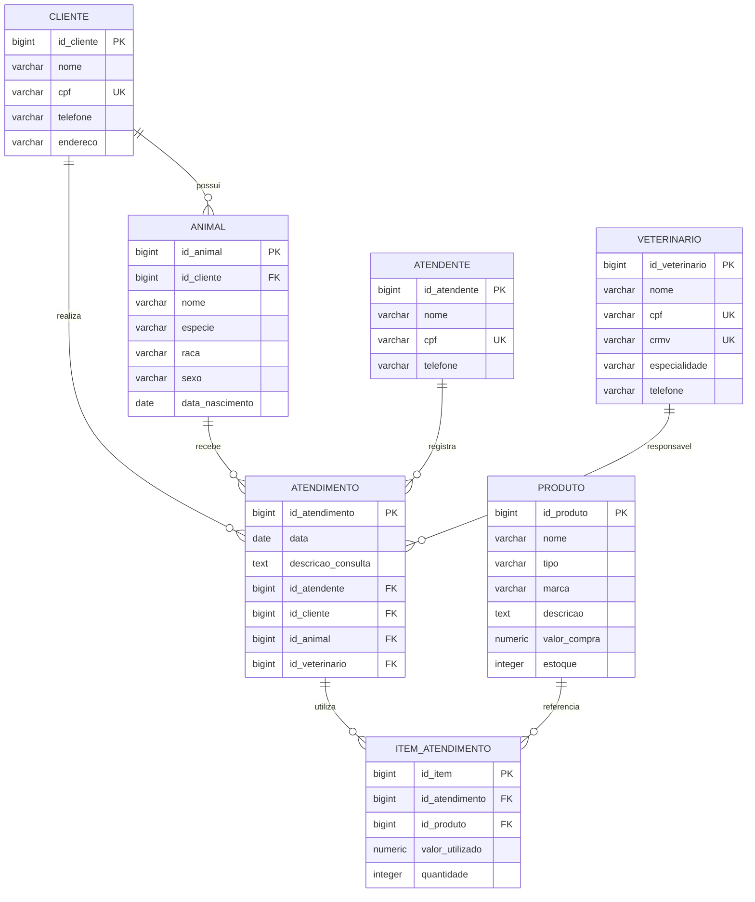

# Clínica Veterinária — Banco de Dados PostgreSQL

## 1. Apresentação do projeto

### Tema
Sistema de banco de dados para uma **Clínica Veterinária**, desenvolvido em PostgreSQL.

### Objetivo geral
Modelar e implementar um banco de dados capaz de armazenar e relacionar informações de **clientes, animais, atendentes, veterinários, produtos e atendimentos**, permitindo registrar consultas e os produtos utilizados em cada atendimento.

### Público-alvo
Clínicas veterinárias de pequeno e médio porte, atendentes, veterinários e responsáveis administrativos que precisam organizar os dados dos clientes, seus animais e os atendimentos realizados.

## 2. Modelo de dados relacional

O modelo utiliza as seguintes entidades:

- **Cliente** — responsável pelos animais.
- **Animal** — paciente pertencente a um cliente.
- **Atendente** — funcionário que registra o atendimento.
- **Veterinário** — profissional responsável pelo atendimento.
- **Atendimento** — registro da consulta/procedimento.
- **Produto** — produto disponível na clínica.
- **Item Atendimento** — tabela associativa que registra quais produtos foram utilizados em cada atendimento.

### Diagrama ER em Mermaid



### Cardinalidades

| Relacionamento | Cardinalidade | Explicação |
|---|---|---|
| Cliente → Animal | 1:N | Um cliente pode possuir vários animais. |
| Cliente → Atendimento | 1:N | Um cliente pode ter vários atendimentos registrados. |
| Animal → Atendimento | 1:N | Um animal pode receber vários atendimentos. |
| Atendente → Atendimento | 1:N | Um atendente pode registrar vários atendimentos. |
| Veterinário → Atendimento | 1:N | Um veterinário pode ser responsável por vários atendimentos. |
| Atendimento → Item Atendimento | 1:N | Um atendimento pode utilizar vários itens. |
| Produto → Item Atendimento | 1:N | Um produto pode aparecer em vários itens de atendimento. |

> Observação: a tabela `ITEM_ATENDIMENTO` resolve a relação de muitos-para-muitos entre `ATENDIMENTO` e `PRODUTO`, pois um atendimento pode utilizar vários produtos e um produto pode ser utilizado em vários atendimentos.

## 3. Estrutura do projeto

```text
clinica-veterinaria/
├── README.md
└── scripts/
    ├── v1__create_table_cliente.sql
    ├── v1__create_table_animal.sql
    ├── v1__create_table_atendente.sql
    ├── v1__create_table_veterinario.sql
    ├── v1__create_table_produto.sql
    ├── v1__create_table_atendimento.sql
    ├── v1__create_table_item_atendimento.sql
    ├── v1__insert_into_cliente.sql
    ├── v1__insert_into_animal.sql
    ├── v1__insert_into_atendente.sql
    ├── v1__insert_into_veterinario.sql
    ├── v1__insert_into_produto.sql
    ├── v1__insert_into_atendimento.sql
    ├── v1__insert_into_item_atendimento.sql
    ├── v1__update_produto.sql
    ├── v1__delete_produto_teste.sql
    └── v1__consultas_validacao.sql
```

## 4. Implementação no PostgreSQL

Execute os scripts de criação nesta ordem:

1. Cliente
2. Animal
3. Atendente
4. Veterinário
5. Produto
6. Atendimento
7. Item Atendimento

Depois execute os scripts de `INSERT`, o `UPDATE`, o `DELETE` e, por último, as consultas de validação.

Todos os scripts foram pensados para poderem ser executados novamente sem gerar erro de criação ou duplicação dos dados de exemplo.

## 5. Integridade e regras

O projeto utiliza:

- `PRIMARY KEY` para identificação única.
- `FOREIGN KEY` para manter os relacionamentos.
- `NOT NULL` nos campos obrigatórios.
- `UNIQUE` para CPF e CRMV.
- `CHECK` para impedir valores inválidos.
- `ON DELETE RESTRICT` para evitar exclusão de registros que estejam sendo utilizados.
- `ON DELETE CASCADE` somente no relacionamento entre atendimento e seus itens.
- `ON CONFLICT DO NOTHING` nos inserts para permitir reexecução.
- Valores monetários com `NUMERIC(10,2)`.
- Datas com `DATE`.
- Identificadores com `BIGINT GENERATED BY DEFAULT AS IDENTITY`.

## 6. DML: INSERT, UPDATE e DELETE

Os arquivos de inserção possuem dados de exemplo suficientes para testar os relacionamentos. O arquivo de `UPDATE` altera o preço de um produto de forma idempotente. O arquivo de `DELETE` remove um produto criado especificamente para o teste de exclusão e que não possui dependências.

## 7. Como executar

No PostgreSQL/psql:

```bash
psql -U postgres -d clinica_veterinaria -f scripts/v1__create_table_cliente.sql
psql -U postgres -d clinica_veterinaria -f scripts/v1__create_table_animal.sql
psql -U postgres -d clinica_veterinaria -f scripts/v1__create_table_atendente.sql
psql -U postgres -d clinica_veterinaria -f scripts/v1__create_table_veterinario.sql
psql -U postgres -d clinica_veterinaria -f scripts/v1__create_table_produto.sql
psql -U postgres -d clinica_veterinaria -f scripts/v1__create_table_atendimento.sql
psql -U postgres -d clinica_veterinaria -f scripts/v1__create_table_item_atendimento.sql
```

Depois:

```bash
psql -U postgres -d clinica_veterinaria -f scripts/v1__insert_into_cliente.sql
psql -U postgres -d clinica_veterinaria -f scripts/v1__insert_into_animal.sql
psql -U postgres -d clinica_veterinaria -f scripts/v1__insert_into_atendente.sql
psql -U postgres -d clinica_veterinaria -f scripts/v1__insert_into_veterinario.sql
psql -U postgres -d clinica_veterinaria -f scripts/v1__insert_into_produto.sql
psql -U postgres -d clinica_veterinaria -f scripts/v1__insert_into_atendimento.sql
psql -U postgres -d clinica_veterinaria -f scripts/v1__insert_into_item_atendimento.sql
psql -U postgres -d clinica_veterinaria -f scripts/v1__update_produto.sql
psql -U postgres -d clinica_veterinaria -f scripts/v1__delete_produto_teste.sql
psql -U postgres -d clinica_veterinaria -f scripts/v1__consultas_validacao.sql
```

## 8. Regras de nomenclatura

Os arquivos seguem o padrão solicitado:

```text
[versão]__[ação]_[descrição/objeto].sql
```

Exemplo:

```text
v1__create_table_cliente.sql
v1__insert_into_cliente.sql
v1__update_produto.sql
```

## 9. GitHub

Para publicar no GitHub:

```bash
git init
git add .
git commit -m "feat: banco de dados da clínica veterinária"
git branch -M main
git remote add origin SEU_REPOSITORIO_GITHUB
git push -u origin main
```

---
**Projeto acadêmico — Banco de Dados / PostgreSQL**
