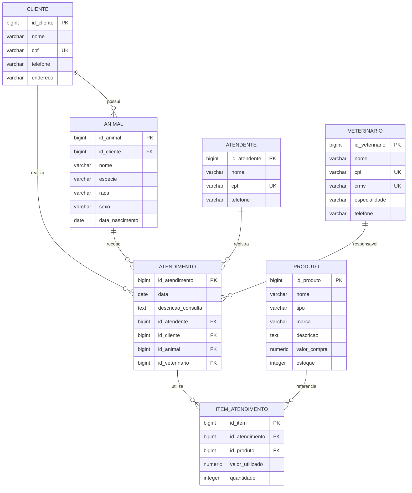

# Clínica Veterinária — Banco de Dados PostgreSQL

## 1. Apresentação do projeto

### Tema
Sistema de banco de dados para uma **Clínica Veterinária**, desenvolvido em PostgreSQL.

### Objetivo geral
Modelar e implementar um banco de dados capaz de armazenar e relacionar informações de **clientes, animais, atendentes, veterinários, produtos e atendimentos**, permitindo registrar consultas e os produtos utilizados em cada atendimento.

### Público-alvo
Clínicas veterinárias de pequeno e médio porte, atendentes, veterinários e responsáveis administrativos que precisam organizar os dados dos clientes, seus animais e os atendimentos realizados.

## 2. Modelo de dados relacional

O modelo utiliza as seguintes entidades:

- **Cliente** — responsável pelos animais.
- **Animal** — paciente pertencente a um cliente.
- **Atendente** — funcionário que registra o atendimento.
- **Veterinário** — profissional responsável pelo atendimento.
- **Atendimento** — registro da consulta/procedimento.
- **Produto** — produto disponível na clínica.
- **Item Atendimento** — tabela associativa que registra quais produtos foram utilizados em cada atendimento.

### Diagrama ER em Mermaid



### Cardinalidades

| Relacionamento | Cardinalidade | Explicação |
|---|---|---|
| Cliente → Animal | 1:N | Um cliente pode possuir vários animais. |
| Cliente → Atendimento | 1:N | Um cliente pode ter vários atendimentos registrados. |
| Animal → Atendimento | 1:N | Um animal pode receber vários atendimentos. |
| Atendente → Atendimento | 1:N | Um atendente pode registrar vários atendimentos. |
| Veterinário → Atendimento | 1:N | Um veterinário pode ser responsável por vários atendimentos. |
| Atendimento → Item Atendimento | 1:N | Um atendimento pode utilizar vários itens. |
| Produto → Item Atendimento | 1:N | Um produto pode aparecer em vários itens de atendimento. |

> Observação: a tabela `ITEM_ATENDIMENTO` resolve a relação de muitos-para-muitos entre `ATENDIMENTO` e `PRODUTO`, pois um atendimento pode utilizar vários produtos e um produto pode ser utilizado em vários atendimentos.

## 3. Exemplos:

```text
v1.0__create_table_cliente.sql
v1.0__insert_into_cliente.sql
```
