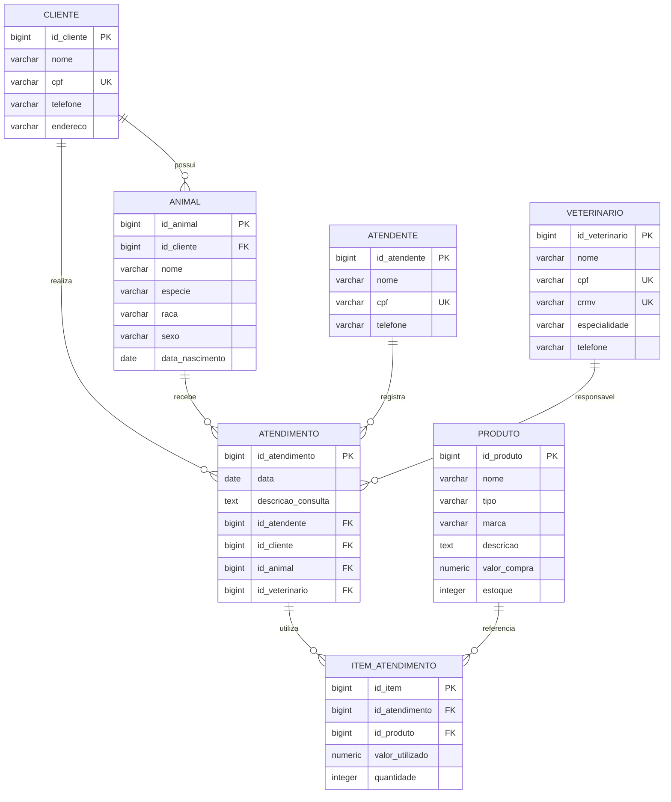

# Clínica Veterinária — Banco de Dados PostgreSQL

### [Link do protótipo de tela principal](https://veterinario-mocha.vercel.app/)

## 1. Apresentação do projeto

### Tema
Sistema de banco de dados para uma **Clínica Veterinária**, desenvolvido em PostgreSQL.

### Objetivo geral
Modelar e implementar um banco de dados capaz de armazenar e relacionar informações de **clientes, animais, atendentes, veterinários, produtos e atendimentos**, permitindo registrar consultas e os produtos utilizados em cada atendimento.

### Público-alvo
Clínicas veterinárias de pequeno e médio porte, atendentes, veterinários e responsáveis administrativos que precisam organizar os dados dos clientes, seus animais e os atendimentos realizados.

## 2. Modelo de dados relacional

O modelo utiliza as seguintes entidades:

- **Cliente** — responsável pelos animais.
- **Animal** — paciente pertencente a um cliente.
- **Atendente** — funcionário que registra o atendimento.
- **Veterinário** — profissional responsável pelo atendimento.
- **Atendimento** — registro da consulta/procedimento.
- **Produto** — produto disponível na clínica.
- **Item Atendimento** — tabela associativa que registra quais produtos foram utilizados em cada atendimento.

### Diagrama ER em Mermaid

